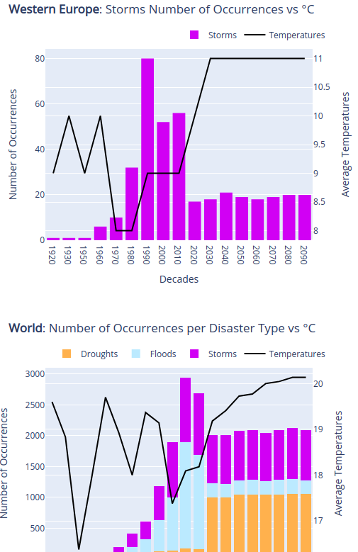

# Table of Contents

1.  [Dataset](#orgc47d4f4)
    1.  [Variables](#org375b640)
    2.  [Data sources](#orga9814b8)
        1.  [`Decade`](#org9a453d6)
        2.  [`UN_Geosheme_Subregion`](#org456df88)
        3.  [`Disaster_Type`](#org8b555ad)
        4.  [`RCP`](#orgd21bc15)
        5.  [`DO`](#org3699d6f)
        6.  [`Human_Impact`](#org80d4f73)
        7.  [`Financial_Impact`](#org549fb58)
        8.  [`°C`](#org17a6ab1)
        9.  [`Geo`](#org0e8785a)
2.  [Prototyping](#orga28fd06)
    1.  [Features](#org45e8fbb)
    2.  [Wireframe](#org12ad4bf)
        1.  [World map](#org8383275)
        2.  [World & Regional focus](#org43bed8e)
3.  [Development](#org04c9191)
    1.  [Why did we pick Dash?](#org032bdd1)
    2.  [Structure of `app.py`](#org02e9807)
        1.  [Globals](#org6d654c8)
            -   [Libraries](#org51bb6cb)
            -   [Initialisation](#org97fa436)
            -   [Functions](#orgd5a9485)
            -   [Sidebar](#org66ab0e9)
        2.  [Layout](#org68efc38)
        3.  [Callback functions](#org4f22934)
            -   [Charts](#org98726a7)
            -   [Timeline title](#org01d6eeb)
            -   [Timeline, Disaster, Magnitude, RCP selectors](#orga981e87)
            -   [Side panel](#org7177013)
        4.  [Main](#org12ee1c3)
    3.  [Visual identity guidelines](#org8c53c7d)
        1.  [Colors](#org023b79d)
            -   [Primary colors](#orgf1eb46b)
            -   [Secondary colors](#orgedfcb44)
        2.  [Fonts](#orgf35637d)
            -   [Primary fonts](#org703ddda)
            -   [Secondary fonts](#org7055933)
        3.  [Logo](#orgb5f9c4a)
            -   [Symbol](#org360bc07)
            -   [Logotype](#org0af2c2c)
    4.  [How to contribute](#orga1f0296)
        1.  [Setting up a new Git repository](#orgce71443)
        2.  [Adding or modifying owned files (`push`)](#org5c294c0)
        3.  [Submit proposed changes to review (`pull-request`)](#org9b58eb0)
4.  [Tools that we used](#orgb818358)
5.  [How to run the Dashboard](#org02dc5af)

# Dataset

## Variables

<table border="2" cellspacing="0" cellpadding="6" rules="groups" frame="hsides">

<colgroup>
<col  class="org-left" />

<col  class="org-left" />

<col  class="org-left" />
</colgroup>
<thead>
<tr>
<th scope="col" class="org-left">Variable name</th>
<th scope="col" class="org-left">Data type</th>
<th scope="col" class="org-left">Description/Example</th>
</tr>
</thead>

<tbody>
<tr>
<td class="org-left">`Decade`</td>
<td class="org-left">int64</td>
<td class="org-left">1900, 1910, &#x2026;, 2080, 2090</td>
</tr>

<tr>
<td class="org-left">`UN_Geosheme_Subregion`</td>
<td class="org-left">str</td>
<td class="org-left">'Australia and New Zealand', 'Caribbean', etc.</td>
</tr>

<tr>
<td class="org-left">`Disaster_Type`</td>
<td class="org-left">str</td>
<td class="org-left">Either 'Floods', 'Droughts' or 'Storms'</td>
</tr>

<tr>
<td class="org-left">`RCP`</td>
<td class="org-left">float64</td>
<td class="org-left">NaN for the past, either 2.6, 4.5, 6.0 or 8.5 for the future</td>
</tr>

<tr>
<td class="org-left">`DO`</td>
<td class="org-left">int64</td>
<td class="org-left">Provides the number of disasters<a id="fnr.1" class="footref" href="#fn.1">1</a>.</td>
</tr>

<tr>
<td class="org-left">`Human_Impact`</td>
<td class="org-left">int64</td>
<td class="org-left">Provides the number of impacted people<a id="fnr.1.100" class="footref" href="#fn.1">1</a>.</td>
</tr>

<tr>
<td class="org-left">`Financial_Impact`</td>
<td class="org-left">int64</td>
<td class="org-left">Provides the financial impact<a id="fnr.1.100" class="footref" href="#fn.1">1</a>.</td>
</tr>

<tr>
<td class="org-left">`°C`</td>
<td class="org-left">int64</td>
<td class="org-left">Provides the temperature in Celsius degrees<a id="fnr.2" class="footref" href="#fn.2">2</a></td>
</tr>

<tr>
<td class="org-left">`Geo`</td>
<td class="org-left">GeoPandas</td>
<td class="org-left">Geospatial data delimitating geoscheme sub regions on the map</td>
</tr>
</tbody>
</table>

## Data sources

### `Decade`

-   Source: in-house
-   Values: 
    
        Decade = [1900, 1910, 1920, 1930, 1940, 1950, 1960, 1970, 1980, 1990, 2000, 2010, 2020, 2030, 2040, 2050, 2060, 2070, 2080, 2090]
-   Notes: each value represents a decade. For example, `2020` starts with the year 2020 and ends with the year 2029.

### `UN_Geosheme_Subregion`

-   Source: [UN Geographic Intermediary Regions](https://unstats.un.org/unsd/methodology/m49/) used by the UN Statistics Division in its publications and databases.
-   Values:
    
        UN_Geosheme_Subregion = ['Australia and New Zealand','Caribbean','Central America','Central Asia','Eastern Africa','Eastern Asia','Eastern Europe','Melanesia','Micronesia','Middle Africa','Northern Africa','Northern America','Northern Europe','Polynesia','South America','South-Eastern Asia','Southern Africa','Southern Asia','Southern Europe','Western Africa','Western Asia','Western Europe']
-   Notes: This classification is also referred as [United Nations geoscheme](https://en.wikipedia.org/wiki/United_Nations_geoscheme) and [UN M49](https://en.wikipedia.org/wiki/UN_M49).

### `Disaster_Type`

-   Source: in-house
-   Values:

    Disaster_Type = ['Droughts', 'Floods', 'Storms']

-   Notes: These disasters will be respectively described in the following pages : [droughts](https://github.com/dataforgoodfr/batch8_worldbank/tree/master/model_secheresse), [floods](https://github.com/dataforgoodfr/batch8_worldbank/tree/master/model_innondations), and [storms](https://github.com/dataforgoodfr/batch8_worldbank/tree/master/model_tempetes)

### `RCP`

-   Source: [IPCC](https://www.iiasa.ac.at/web-apps/tnt/RcpDb/dsd?Action=htmlpage&page=welcome)
-   Values:

    RCP = [2.6, 4.5, 6.0, 8.5]

-   Notes: Representative Concentration Pathways (RCP) are greenhouse gas concentration (not emissions) trajectories adopted by the IPCC. Four pathways were used for climate modeling and research for the IPCC fifth Assessment Report (AR5) in 2014. The pathways describe different climate futures, all of which are considered possible depending on the volume of greenhouse gases (GHG) emitted in the years to come. The RCPs are labelled after a possible range of radiative forcing values in the year 2100.
    
    

### `DO`

-   Source: In-house (for prediction)
-   Values: Natural number (non-negative integers)
-   Notes: For explanation on past and future (based on in house statistical models) **Disaster Occurrences** (DO) see: [droughts](https://github.com/dataforgoodfr/batch8_worldbank/tree/master/model_secheresse), [floods](https://github.com/dataforgoodfr/batch8_worldbank/tree/master/model_innondations), and [storms](https://github.com/dataforgoodfr/batch8_worldbank/tree/master/model_tempetes) pages.

### `Human_Impact`

-   Source: In-house (for prediction)
-   Values: Natural number (non-negative integers)
-   Notes: For explanation on past and future (based on in house statistical models) Human Impact see: [droughts](https://github.com/dataforgoodfr/batch8_worldbank/tree/master/model_secheresse), [floods](https://github.com/dataforgoodfr/batch8_worldbank/tree/master/model_innondations), and [storms](https://github.com/dataforgoodfr/batch8_worldbank/tree/master/model_tempetes) pages.

### `Financial_Impact`

-   Source: In-house (for prediction)
-   Values: Natural number (non-negative integers)
-   Notes: For explanation on past and future (based on in house statistical models) Financial Impact see: [droughts](https://github.com/dataforgoodfr/batch8_worldbank/tree/master/model_secheresse), [floods](https://github.com/dataforgoodfr/batch8_worldbank/tree/master/model_innondations), and [storms](https://github.com/dataforgoodfr/batch8_worldbank/tree/master/model_tempetes) pages.

### `°C`

-   Source: [World Bank](https://climateknowledgeportal.worldbank.org/download-data)
-   Values: Temperatures

### `Geo`

-   Source: In-house (generated by [this script](https://github.com/dataforgoodfr/batch8_worldbank/blob/master/Dashboard/scripts/ContourGeneration.ipynb))

# Prototyping

## Features

<table border="2" cellspacing="0" cellpadding="6" rules="groups" frame="hsides">

<colgroup>
<col  class="org-left" />

<col  class="org-left" />
</colgroup>
<thead>
<tr>
<th scope="col" class="org-left">Feature name</th>
<th scope="col" class="org-left">Description</th>
</tr>
</thead>

<tbody>
<tr>
<td class="org-left">Main layout</td>
<td class="org-left">Organise features and widgets on the main page</td>
</tr>

<tr>
<td class="org-left">World map</td>
<td class="org-left">Displays the world map, with UN sub regions</td>
</tr>

<tr>
<td class="org-left">World map dataviz</td>
<td class="org-left">Displays data on the worldmap, with a legend</td>
</tr>

<tr>
<td class="org-left">RCP thermometer</td>
<td class="org-left">To choose among the 4 RCP</td>
</tr>

<tr>
<td class="org-left">Disaster toggle</td>
<td class="org-left">To choose among 1 over 3 disaster type</td>
</tr>

<tr>
<td class="org-left">Impact toggle</td>
<td class="org-left">To choose between human or financial impact</td>
</tr>

<tr>
<td class="org-left">Selectable timeframe</td>
<td class="org-left">To choose from 1 to 20 decades</td>
</tr>

<tr>
<td class="org-left">Sub region mouseover</td>
<td class="org-left">Mouseover on a sub region triggers a popup</td>
</tr>

<tr>
<td class="org-left">Sub region popup</td>
<td class="org-left">Shows region's figures</td>
</tr>

<tr>
<td class="org-left">World figures</td>
<td class="org-left">Shows world figures</td>
</tr>

<tr>
<td class="org-left">World figures expand</td>
<td class="org-left">Button that triggers world figures popup</td>
</tr>

<tr>
<td class="org-left">World figures popup</td>
<td class="org-left">Expends world figures additional figures</td>
</tr>

<tr>
<td class="org-left">Play/Pause toggle</td>
<td class="org-left">launch a per decade animation on the world map</td>
</tr>
</tbody>
</table>

## Wireframe

### World map

### World & Regional focus

# Development

## Why did we pick [Dash](https://plotly.com/dash/)?

As we wanted to use Python to build the Dashboard we had to pick among [Python dashboard libraries](https://pyviz.org/tools.html) :

According to following benchmarck the team decided to develop the PoC with ****Dash****

<table border="2" cellspacing="0" cellpadding="6" rules="groups" frame="hsides">

<colgroup>
<col  class="org-left" />

<col  class="org-left" />

<col  class="org-left" />

<col  class="org-left" />

<col  class="org-left" />
</colgroup>
<thead>
<tr>
<th scope="col" class="org-left">&#xa0;</th>
<th scope="col" class="org-left">Maturity</th>
<th scope="col" class="org-left">Popularity</th>
<th scope="col" class="org-left">Simplicity</th>
<th scope="col" class="org-left">Adaptability</th>
</tr>
</thead>

<tbody>
<tr>
<td class="org-left">Streamlit</td>
<td class="org-left">C</td>
<td class="org-left">A</td>
<td class="org-left">A</td>
<td class="org-left">C</td>
</tr>

<tr>
<td class="org-left">Dash</td>
<td class="org-left">B</td>
<td class="org-left">A</td>
<td class="org-left">B</td>
<td class="org-left">B</td>
</tr>

<tr>
<td class="org-left">Voila</td>
<td class="org-left">C</td>
<td class="org-left">C</td>
<td class="org-left">A</td>
<td class="org-left">C</td>
</tr>
</tbody>
</table>

****Maturity****: Based on the age of the project and how stable it is.

****Popularity****: Based on adoption and GitHub stars.

****Simplicity****: Based on how easy it is to get started using the library.

****Adaptability****: Based on how flexible and opinionated the library is.

## Structure of `app.py`

### Globals

#### Libraries

    import pandas as pd
    import json
    # Graph library
    import plotly.express as px
    import plotly.graph_objects as go
    # Dashboard
    import dash
    import dash_html_components as html
    # import dash_daq as daq
    import dash_core_components as dcc
    from dash.dependencies import Input, Output, State
    from plotly.subplots import make_subplots
    import dash_bootstrap_components as dbc

#### Initialisation

##### Style

    external_stylesheets = ['assets/style.css']
    app = dash.Dash(__name__, external_stylesheets=external_stylesheets)

##### Import geo data

    with open('data/un_subregion_contours.geojson') as json_data:
        regions_data = json.load(json_data)

##### Import Pandas DataFrame

    df_disasters = pd.read_csv("data/input-magnitude.csv", decimal=".").rename({'DO': 'Number of Occurrences'}, axis=1)
    df_extra = pd.read_csv("data/input-extra.csv", decimal=".")

##### Preparation of global variables

    dict_dataset_labels = {
        "UN_Geosheme_Subregion": "UN Subregion",
        "Disaster_Type": "Type of Disaster",
        "RCP": "Climate Prospective Scenario",
        "Financial_Impact": "Total Cost ($US)",
        "Human_Impact": "Affected People",
    
        "Number of Occurrences": "Nb of events",
        "°C": "Average temperature (°C)",
        "Rain": "Rainfall",
    }
    list_disasters = df_disasters['Disaster_Type'].unique()
    list_features = ['Number of Occurrences', 'Financial Impact', 'Human Impact']
    list_rcp = df_disasters['RCP'].unique()
    YEARS = list(df_disasters.Decade.drop_duplicates())
    dict_dataset_aggregation_method = {
        "Financial_Impact": "sum",
        "Human_Impact": "sum",
        "Number of Occurrences": "sum",
        "°C": "mean",
        "Rain": "mean",
    }
    dict_magnitude_types = {
        "Number of Occurrences": 'Number of Occurrences',
        "Financial Impact": 'Financial_Impact',
        'Human Impact': 'Human_Impact',
    }

-   Preparation of main DataFrames

    Sorting values and filling NaN
    
        df_disasters = df_disasters.sort_values(by=['UN_Geosheme_Subregion'])
        df_disasters["RCP"].fillna(value=0, inplace=True)
        df_extra = df_extra.sort_values(by=['UN_Geosheme_Subregion'])
        df_extra["RCP"].fillna(value=0, inplace=True)

-   Mapbox credentials

        mapbox_access_token = "pk.eyJ1IjoibWFoZGlrYXJhYmliZW4iLCJhIjoiY2tmeWlnZzJqMXhyMzJ0czgzcWc3ejViNyJ9.MsvguTk0F7cxDBaV1Zlm_g"
        mapbox_style = "mapbox://styles/mahdikarabiben/ckgzi4dac1jez19qlanqcpp5l"

-   Choropleth color settings to display features on the map

        dict_feature_colors = {
            "Droughts": "YlOrRd",
            "Storms": "RdPu",
            "Floods": "Blues",
        }  

#### Functions

##### Build choropleth map from dataframe and  geojson

    def choropleth_map(df, impact, colordisaster):
        return go.Figure(
    	px.choropleth_mapbox(
    	    data_frame=df,
    	    geojson=regions_data,
    	    locations='UN_Geosheme_Subregion',
    	    featureidkey="properties.subregion",
    	    color=impact,
    	    color_continuous_scale=colordisaster,
    	    mapbox_style=mapbox_style,
    	    opacity=0.8,
    	    center={"lat": 10.190, "lon": 64.709},
    	    zoom=1.15,
    	    hover_name='UN_Geosheme_Subregion',
    	    labels=dict_dataset_labels,
    	    # range_color=[0, 6500]
    	)
        ) 

##### Display map

    def display_map(df, impact, colordisaster):
        fig = choropleth_map(df, impact, colordisaster)
    
        # Specify layout information
        fig.update_layout(
    	margin={"r": 0, "t": 0, "l": 0, "b": 0},
    	mapbox_accesstoken=mapbox_access_token
        ),
        fig.update_layout(coloraxis=dict(colorbar_x=0,
    				     colorbar_xanchor="left",
    				     colorbar_y=0.25,
    				     colorbar_len=0.5,
    				     colorbar_bordercolor='#ffffff'
    				     # colorbar_thickness=20
    				     )),
        fig.update_coloraxes(colorbar_bgcolor="white")
    
        return fig
    
    
    def slice_data_on_decades(df_source, rcp_type, decade_start, decade_end):
        '''
        Return the slice of the dataframe, on selected decades only
        '''
        df = pd.concat(
    	[df_source[  # historical data
    	     (df_source['Decade'] >= decade_start)
    	     & (df_source['Decade'] <= min(decade_end, 2010))
    	     & (df_source['RCP'] == 0)],
    	 df_source[  # predicted data, selected on one of the RCP's scenario
    	     (df_source['Decade'] >= max(2020, decade_start))
    	     & (df_source['Decade'] <= decade_end)
    	     & (df_source['RCP'] == rcp_type)]],
    	axis=0)
        return df

##### Layout

-   Title & Logo

        def Title_App():
            return html.Div(
        	# className="pretty_container-3",
        	children=[
        	    #html.Img(id="logo", src=app.get_asset_url("WorldBank_Logo@2x.png")),
        	    html.Img(id="logo", src=app.get_asset_url("logo.png")),
        	    html.Br(),
        	    dcc.Markdown("""### Natural Disasters Map"""),
        	],
            )

-   Disaster selector

        def disaster_type_card():
            return html.Div(
        	children=[
        	    html.H5(dcc.Markdown("**Select a Disaster**")),
        	    dcc.RadioItems(
        		id="Disaster-Selector",
        		options=[{'label': i, 'value': i} for i in list_disasters],
        		value='Floods',
        		labelStyle={  # "display": "inline-block",
        		    "margin-top": "0px",
        		    "font-size": "16px",
        		    "padding": "12px 12px 12px 0px",
        		},
        		labelClassName="data-group-labels",
        	    )
        	]
        
            )

-   Magnitude selector

        def magnitude_type_card():
            return html.Div(
        	children=[
        	    html.H5(dcc.Markdown("**Select a Magnitude**")),
        	    dcc.RadioItems(
        		id="Magnitude-Selector",
        		options=[{'label': i, 'value': i} for i in list_features],
        		value='Number of Occurrences',
        		labelStyle={  # "display": "inline-block",
        		    "margin-top": "0px",
        		    "font-size": "16px",
        		    "padding": "12px 12px 12px 0px",
        		},
        		labelClassName="data-group-labels",
        	    )
        	]
        
            )

-   RCP selector

        def climate_scenario():
            return html.Div(
        	children=[
        	    html.H5(dcc.Markdown("**Select* a RCP**")),
        	    html.H6(dcc.Markdown("*Only effective from 2020")),
        	    html.Br(),
        	    dcc.Slider(
        		id="scenario-slider",
        		min=0,
        		max=10,
        		value=2.6,  # default value
        		step=None,
        		# marks={2.6: "2.6°C", 4.5: "4.5°C", 6.0: "6.0°C",8.5:"8.5°C"},
        		marks={
        		    # 0: {'label': '0', 'style': {'color': '#77b0b1'}},
        		    2.6: {'label': '2.6', 'style': {'color': '#77b0b1'}},
        		    4.5: {'label': '4.5'},
        		    6: {'label': '6.0'},
        		    8.5: {'label': '8.5', 'style': {'color': '#f50'}}
        		},
        		disabled=False
        
        	    )
        	]
            )

#### Sidebar

    colors = {
        'background': '#111111',
        'text': '#7FDBFF'
    }
    
    # Add sidebar 
    SIDEBAR_STYLE = {
        # "position": "fixed",
        "top": 0,
        "left": 0,
        "width": "30vw",
        "overflow": "scroll",
        "maxHeight": "100rem"
    }
    
    # the styles for the main content position it to the right of the sidebar and
    # add some padding.
    CONTENT_STYLE = {
        "margin-left": "30rem",
        "margin-right": "2rem",
        "padding": "2rem 1rem",
    }
    
    sidebar = html.Div(
        className="pretty_container-3",
        children=
        [
    	html.Div(
    	    dcc.Graph(id="bc_DOHI",
    		      config={
    			  'displayModeBar': False
    		      }
    		      ),
    	),
    	html.Div(
    	    dcc.Graph(id="bc_ImpactDisasterType",
    		      config={
    			  'displayModeBar': False
    		      }
    		      ),
    	),
        ],
        style=SIDEBAR_STYLE,
    )
    
    content = html.Div(id="page-content", style=CONTENT_STYLE)
    
    # Add collapses 
    collapses = html.Div(
        # className="pretty_container-3",
        # children=
        [
    
    	dbc.Collapse(
    	    sidebar,
    	    id="collapse",
    	),
    
        ]
    )

### Layout

      app.layout = html.Div(
          id="root",
          children=[
    	  html.Div(
    	      id="app-container",
    	      children=[
    		  html.Div(
    		      id="Rectangle_Menu",
    		      className="pretty_container-3",
    		      children=[
    			  html.Div(
    			      # className="pretty-container-3",
    			      children=[Title_App()]
    			  ),
    			  html.Br(),
    			  html.Div(
    			      # className="pretty_container-3",
    			      children=[disaster_type_card()]
    			  ),
    			  html.Br(),
    			  html.Div(
    			      # className="pretty_container-3",
    			      children=[magnitude_type_card()]
    			  ),
    			  html.Br(),
    			  html.Div(
    			      # className="pretty_container-3",
    			      children=[climate_scenario()]
    			  ),
    			  html.Br(),
    			  html.Div(
    
    			      children=[html.Button('Display Charts', id='collapse-button', style={"display": "block"}),
    					html.Button('Hidden Charts', id='collapse-button2', style={"display": "None"})]
    			  ),
    		      ],
    		  ),
    
    		  html.Div(
    		      collapses
    		  ),
    		  html.Div(
    		      id="right-column",
    		      children=[
    			  html.Div(
    			      id="slider-container",
    			      children=[
    				  html.P(
    				      id="slider-text",
    				      children="Drag the slider to choose the decade(s)",
    				  ),
    				  dcc.RangeSlider(
    				      id="years-slider",
    				      min=1900,
    				      max=2090,
    				      step=10,
    				      value=[1960, 2010],
    				      marks={
    					  str(year): {"label": str(year), "style": {"color": "#7fafdf"}} for year in YEARS
    				      },
    				  ),
    			      ],
    			  ),
    			  html.Div(
    			      id="heatmap-container",
    			      children=[
    				  html.P(
    				      "Choropleth map of disaster damages from {0} to {1}".format(min(YEARS),
    												  min(YEARS) + 20),
    				      id="heatmap-title",
    				  ),
    				  dcc.Graph(
    				      id="county-choropleth",
    				      figure=display_map(
    					  df_disasters[(df_disasters['Decade'] >= 1900)
    						  & (df_disasters['Decade'] <= 1920)
    						  & (df_disasters['Disaster_Type'] == 'Floods')
    						  & (df_disasters['RCP'] == 2.6)],
    					  'Human_Impact', 'reds'),
    				      config={
    					  'modeBarButtonsToRemove': ['toImage', 'toggleSpikelines', "pan2d", "select2d",
    								     "lasso2d", "hoverClosestCartesian"]
    				      }
    				  ),
    			      ],
    			  ),
    		      ],
    		  ),
    	      ],
    	  ),
          ],
    )  

### Callback functions

#### Charts

    @app.callback(
        Output("bc_DOHI", "figure"),
        Output("bc_ImpactDisasterType", "figure"),
        [Input("county-choropleth", "clickData"),
         Input("years-slider", "value"),
         Input("Disaster-Selector", "value"),
         Input("scenario-slider", "value"),
         Input("Magnitude-Selector", "value")
         ])
    def update_bar_chart(map_input, years, disaster, scenario, impact):
        if map_input:
    	location = map_input.get('points')[0].get('location')
        else:
    	location = '' # No selected region so display worldwide figures
    
        # Select decades and RCP
        df = slice_data_on_decades(df_disasters, scenario, years[0], years[1])
        df_temperatures = slice_data_on_decades(df_extra[['Decade', 'UN_Geosheme_Subregion', 'RCP', '°C']], scenario,
    					    years[0], years[1])
    
        # Prepare data to display
        df_figs = df.copy()
    
        # Map the text of selected impact with the label of the corresponding dataframe column
        impact_type = dict_magnitude_types[impact]
        # Number of bars
        bins = int((int(years[1]) - int(years[0])) / 10)
    
        # In case we want to force all colors:
        # color_codes= ['#CCFFFF','#CCCCFF','#CC99FF','#009999','#0033FF','#003333',
        # '#9900CC','#FFFF33','#339966','#CC6666','#996633','#009900','#6666FF','#330033',
        # '#FF3333','#FFCCFF','#33FF99','#33FF99','#9999FF','#CC3300','#3300CC','#9999FF']
        # color={}
        # for i in range(21):
        #    color[i] = color_codes[i]
    
        # Chart 1: Region X Disaster X Magnitude VS Temperatures
        # ~~~~~~~~~~~~~~~~~~~~~~~~~~~~~~~~~~~~~~~~~~~~~~~~~~~~~~
    
        # Prepare data
        df_chart1 = df_figs.copy()
        # Keep only occurrences
        #df_chart1.drop(columns=['Financial_Impact','Human_Impact'], inplace=True)
        # Region selection
        if location:
    	to_drop = df_chart1[~(df_chart1['UN_Geosheme_Subregion'] == location)].index
    	df_chart1.drop(to_drop, inplace=True)
        # Disaster selection
        to_drop = df_chart1[~(df_chart1['Disaster_Type'] == disaster)].index
        df_chart1.drop(to_drop, inplace=True)
        # Compute temperatures
        if location: # Get temperatures for the selected region only
    	df_temp_to_merge = df_temperatures[df_temperatures['UN_Geosheme_Subregion'] == location]
        else: # Compute the world mean of temperatures by decade (beware that no weighting with region area has been done)
    	df_temp_to_merge = df_temperatures.groupby(['Decade'])['°C'].mean().reset_index()
        df_chart1.loc[:, 'Temperature'] = df_chart1.Decade.map(df_temp_to_merge.set_index('Decade')['°C'])
    
        # Sorting and reordering
        df_chart1 = df_chart1.sort_values(by=['Decade'])
    
        # Make figure
        subfig1 = make_subplots(specs=[[{"secondary_y": True}]])
        fig2 = px.histogram(df_chart1,
    			x="Decade",
    			y=impact_type,
    			template='plotly',
    			color="Disaster_Type",
    			color_discrete_map={'Floods':'#C5EBFD', 'Storms':'#B561F4', 'Droughts':'#FFAE5D'},
    			nbins=bins,
    			)
    
        fig3 = px.line(df_chart1, x="Decade", y="Temperature", labels={'°C': 'Average Temperature'})
        fig3.update_traces(yaxis="y2", showlegend=True, name='Temperatures', line_color='black')
    
        subfig1.add_traces(fig2.data + fig3.data)
        subfig1.layout.title = "<b>{0}</b>: {1} {2} vs °C".format((location if location else 'World'),disaster,impact)
        subfig1.update_xaxes(type='category')
        subfig1.layout.xaxis.title = "Decades"
        subfig1.layout.yaxis.title = "{0}".format(impact)
        subfig1.layout.yaxis2.title = "Average Temperatures"
        subfig1.update_layout(legend=dict(
    	orientation="h",
    	yanchor="bottom",
    	y=1.02,
    	xanchor="right",
    	x=1
        ))
    
        # Chart 2: World X Magnitude VS Temperatures
        # ~~~~~~~~~~~~~~~~~~~~~~~~~~~~~~~~~~~~~~~~~~
    
        # Prepare data
        df_chart2 = df_figs[['Decade','UN_Geosheme_Subregion','Disaster_Type',impact_type]].copy()
        df_chart2 = df_chart2.groupby(['Decade','Disaster_Type']).sum().reset_index()
        # Compute the world mean of temperatures by decade (beware that no weighting with region area has been done)
        df_temp_to_merge = df_temperatures.groupby(['Decade'])['°C'].mean().reset_index()
        df_chart2.loc[:, 'Temperature'] = df_chart2.Decade.map(df_temp_to_merge.set_index('Decade')['°C'])
    
        # Make figure
        subfig2 = make_subplots(specs=[[{"secondary_y": True}]])
        fig4 = px.histogram(df_chart2,
    			x="Decade",
    			y=impact_type,
    			template='plotly',                        
    			color="Disaster_Type",
    			color_discrete_map={'Floods':'#C5EBFD', 'Storms':'#B561F4', 'Droughts':'#FFAE5D'},
    			nbins=bins,
    			)
    
        fig5 = px.line(df_chart2, x="Decade", y="Temperature", labels={'°C': 'Average Temperature'})
        fig5.update_traces(yaxis="y2", showlegend=True, name='Temperatures', line_color='black')
    
        subfig2.update_layout(barmode = 'stack', xaxis = {'categoryorder': 'category ascending'})	
        subfig2.add_traces(fig4.data + fig5.data)
        subfig2.layout.title = '<b>World</b>: {0} per Disaster Type vs °C'.format(impact)
        subfig2.update_xaxes(type='category')
        subfig2.layout.xaxis.title = "Decades"    
        subfig2.layout.yaxis.title = "{0}".format(impact)
        subfig2.layout.yaxis2.title = "Average Temperatures"
        subfig2.update_layout(legend=dict(
    	orientation="h",
    	yanchor="bottom",
    	y=1.02,
    	xanchor="right",
    	x=1
        ))    
    
        return subfig1, subfig2

#### Timeline title

    @app.callback(Output("heatmap-title", "children"), [Input("years-slider", "value")])
    def update_map_title(year):
        return "Choropleth map from the beginning of the {0}s to the end of the {1}s".format(year[0], year[1])

#### Timeline, Disaster, Magnitude, RCP selectors

    @app.callback(
        Output("county-choropleth", "figure"),
        Input("years-slider", "value"),
        Input("Disaster-Selector", "value"),
        Input("Magnitude-Selector", "value"),
        Input("scenario-slider", "value")
    )
    def update_map(year, DisasterType, MagnitudeType, RcpType):
        """
        Update the map according to the parameters selected by the user
        """
    
        # Selection of the slice of decades to keep
        df = slice_data_on_decades(df_disasters, RcpType, year[0], year[1]).copy()
        # Selection of the disaster to keep
        to_drop = df[~(df['Disaster_Type'] == DisasterType)].index
        df.drop(to_drop, inplace=True)
    
        # Get the color scale settings to display the choropleth
        color = dict_feature_colors[DisasterType]
    
        # Select the feature in the dataset
        magnitude_type = dict_magnitude_types[MagnitudeType]
    
        # Select the feature and aggregate its data on the selected decades
        if dict_dataset_aggregation_method[magnitude_type] == 'sum':
    	df = df.groupby(['UN_Geosheme_Subregion'])[magnitude_type].sum().reset_index()
        elif dict_dataset_aggregation_method[magnitude_type] == 'mean':
    	df = df.groupby(['UN_Geosheme_Subregion'])[magnitude_type].mean().reset_index()
    
        return display_map(df, magnitude_type, color)   

#### Side panel

    @app.callback(Output('collapse', 'style'),
    	      Output('right-column', 'style'),
    	      Output('collapse-button', 'style'),
    	      Output('collapse-button2', 'style'),
    	      [Input('collapse-button', 'n_clicks')],
    	      [Input('collapse-button2', 'n_clicks')],
    	      [State('right-column', 'style')],
    	      [State('collapse', 'style')],
    	      [State('collapse-button', 'style')],
    	      [State('collapse-button2', 'style')]
    	      )
    def callback(n_clicks, nh_clicks, style_map, style, btn1, btn2):
        if style is None or 'display' not in style:
    	style = {'display': 'none'}
    	style_map = {"width": "66vw"}
    	btn1 = {'display': 'block'}
    	btn2 = {"display": "none"}
        else:
    	if style['display'] == 'none':
    	    style['display'] = 'block'
    	    style_map["width"] = "33vw"
    	    btn1['display'] = 'none'
    	    btn2["display"] = "block"
    	else:
    	    style['display'] = 'none'
    	    style_map["width"] = "66vw"
    	    btn1['display'] = 'block'
    	    btn2["display"] = "none"
    
        return style, style_map , btn1, btn2

### Main

    if __name__ == '__main__':
        app.run_server(debug=True, host="127.0.0.1", port=8050)

## Visual identity guidelines

We will follow World Bank's visual identity guidelines for colors and fonts.

### Colors

#### Primary colors

<table border="2" cellspacing="0" cellpadding="6" rules="groups" frame="hsides">

<colgroup>
<col  class="org-left" />

<col  class="org-left" />
</colgroup>
<thead>
<tr>
<th scope="col" class="org-left">Name</th>
<th scope="col" class="org-left">Hex code</th>
</tr>
</thead>

<tbody>
<tr>
<td class="org-left">Sapphire blue</td>
<td class="org-left">#002244</td>
</tr>

<tr>
<td class="org-left">Sky blue</td>
<td class="org-left">#009FDA</td>
</tr>

<tr>
<td class="org-left">Black</td>
<td class="org-left">#000000</td>
</tr>

<tr>
<td class="org-left">White</td>
<td class="org-left">#FFFFFF</td>
</tr>
</tbody>
</table>

#### Secondary colors

<table border="2" cellspacing="0" cellpadding="6" rules="groups" frame="hsides">

<colgroup>
<col  class="org-left" />

<col  class="org-left" />
</colgroup>
<thead>
<tr>
<th scope="col" class="org-left">Family</th>
<th scope="col" class="org-left">Hex code</th>
</tr>
</thead>

<tbody>
<tr>
<td class="org-left">Brighter Warm</td>
<td class="org-left">F05023</td>
</tr>

<tr>
<td class="org-left">Brighter Warm</td>
<td class="org-left">FDB714</td>
</tr>

<tr>
<td class="org-left">Brighter Warm</td>
<td class="org-left">2EB1C2D</td>
</tr>

<tr>
<td class="org-left">Brighter Warm</td>
<td class="org-left">F78D28</td>
</tr>

<tr>
<td class="org-left">Brighter Cool</td>
<td class="org-left">009CA7</td>
</tr>

<tr>
<td class="org-left">Brighter Cool</td>
<td class="org-left">00AB51</td>
</tr>

<tr>
<td class="org-left">Brighter Cool</td>
<td class="org-left">872B90</td>
</tr>

<tr>
<td class="org-left">Brighter Cool</td>
<td class="org-left">00A996</td>
</tr>

<tr>
<td class="org-left">Muted Warm</td>
<td class="org-left">98252B</td>
</tr>

<tr>
<td class="org-left">Muted Warm</td>
<td class="org-left">E16A2D</td>
</tr>

<tr>
<td class="org-left">Muted Warm</td>
<td class="org-left">B88C1D</td>
</tr>

<tr>
<td class="org-left">Muted Cool</td>
<td class="org-left">614776</td>
</tr>

<tr>
<td class="org-left">Muted Cool</td>
<td class="org-left">006068</td>
</tr>

<tr>
<td class="org-left">Muted Cool</td>
<td class="org-left">006450</td>
</tr>
</tbody>
</table>

### Fonts

#### Primary fonts

#### Secondary fonts

### Logo

#### Symbol

#### Logotype

## How to contribute

### Setting up a new Git repository

-   Clone project locally
    
        $ git init
        $ git clone https://github.com/dataforgoodfr/batch8_worldbank/tree/master/plateforme
-   Ask to join our GitHub

### Adding or modifying owned files (`push`)

When adding a new file or modifying a file that you own, do:

    $ git add filename
    $ git commit
    $ git push

Where `filename` is the name of the file

### Submit proposed changes to review (`pull-request`)

When modifying an existing file, if you're not its owner, you have to submit the modifications to its owner (i.e. reviewer). Ownership is distributed as follow :

<table border="2" cellspacing="0" cellpadding="6" rules="groups" frame="hsides">

<colgroup>
<col  class="org-left" />

<col  class="org-left" />
</colgroup>
<thead>
<tr>
<th scope="col" class="org-left">Owner GitHub name</th>
<th scope="col" class="org-left">File</th>
</tr>
</thead>

<tbody>
<tr>
<td class="org-left">mahdiqb</td>
<td class="org-left">`./app.py`</td>
</tr>

<tr>
<td class="org-left">morgandavidson</td>
<td class="org-left">`./README.md`</td>
</tr>

<tr>
<td class="org-left">alencon</td>
<td class="org-left">`./asset/style.css`</td>
</tr>

<tr>
<td class="org-left">morgandavidson</td>
<td class="org-left">`./scripts/DataGeneration.ipynb`</td>
</tr>
</tbody>
</table>

To submit changes reviewees have to do : 

    $ git branch new-branch        #Creates a new branch nammed "new-branch"
    $ git checkout new-branch      #Switch to "new-branch"
    # alternatively these two commands can be condensed to "git checkout -b new-branch"
    $ git add filename
    $ git commit
    $ git push origin new-branch
    $ git checkout master          #Switch back to master

Then go on our [GitHub](https://github.com/dataforgoodfr/batch8_worldbank), and simply click on `compare & pull request` and pick a reviewer. Or do

-   cilck on `Pull requests`,
-   then on `New Pull Request`,
-   click on `compare across forks`,
-   select : `dataforgoodfr/batch8_carbon4 | =base: master` <- `revieweename/batch8_carbon4` | `new-branch`,
-   click on `create pull request`
-   enter GitHub reviewer name in `reviewers`, add title and comment,
-   click on `create pull request`

# Tools that we used

<table border="2" cellspacing="0" cellpadding="6" rules="groups" frame="hsides">

<colgroup>
<col  class="org-left" />

<col  class="org-left" />
</colgroup>
<thead>
<tr>
<th scope="col" class="org-left">Tools</th>
<th scope="col" class="org-left">Usage</th>
</tr>
</thead>

<tbody>
<tr>
<td class="org-left">Slack</td>
<td class="org-left">Chat</td>
</tr>

<tr>
<td class="org-left">Pycharm, Jupyter</td>
<td class="org-left">Code editing</td>
</tr>

<tr>
<td class="org-left">Git, GitHub</td>
<td class="org-left">Code storage/versioning</td>
</tr>

<tr>
<td class="org-left">Python, CSS</td>
<td class="org-left">Coding languages</td>
</tr>

<tr>
<td class="org-left">Org-mode, Github, Notion</td>
<td class="org-left">Documentation</td>
</tr>

<tr>
<td class="org-left">Zoom</td>
<td class="org-left">Meetings</td>
</tr>

<tr>
<td class="org-left">dash, dash-daq pandas, gunicorn</td>
<td class="org-left">Python librairies</td>
</tr>

<tr>
<td class="org-left">Krita, Figma</td>
<td class="org-left">Wireframing</td>
</tr>
</tbody>
</table>

# How to run the Dashboard

1.  Install following Python packages:
    -   `pandas`
    -   `plotly`
    -   `dash`
    -   `dash_bootstrap_components`
2.  Download required files and folders:
    
        ├── app.py                               # Dash app code
        ├── ./data          
        │   ├── input-extra.csv                  # Magnitudes by disasters, decades, regions, RCPs
        │   ├── input-magnitude.csv              # Temperatures by decades, Regions, RCPs
        │   └── un_subregion_contours.geojson    # Geodata
        └── ./assets              
            ├── style.css                        # CSS stylesheet
            └── logo.png                         # Dashboard logo
3.  Go to `./` and run 
    
        $ python app.py

# Footnotes

<a id="fn.1" href="#fnr.1">1</a> Given a disaster, a decade, a region, and a climate scenario

<a id="fn.2" href="#fnr.2">2</a> Given a decade, a region, and a climate scenario.
