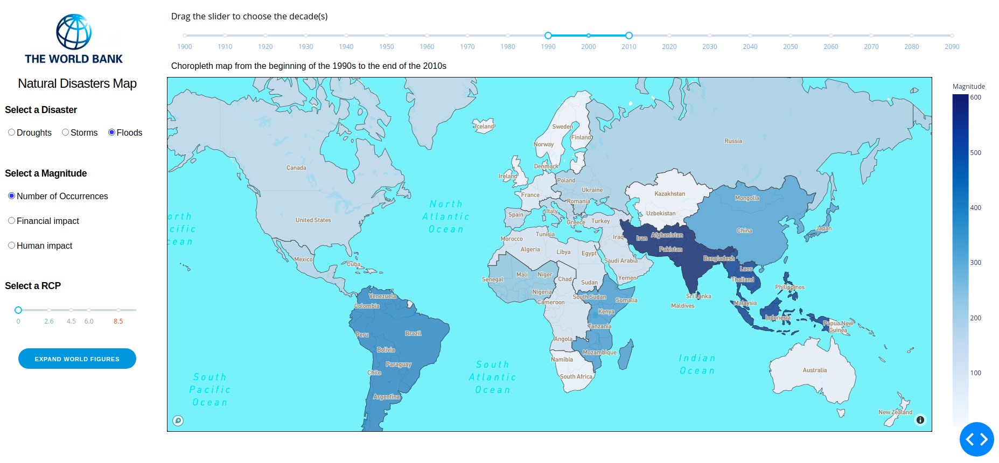
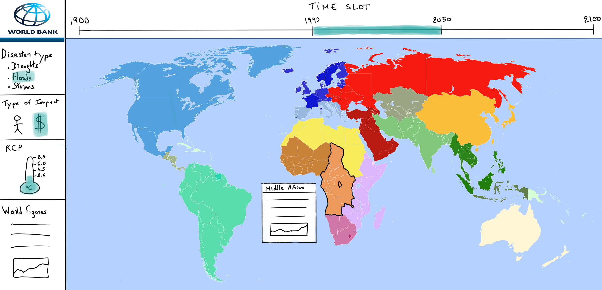
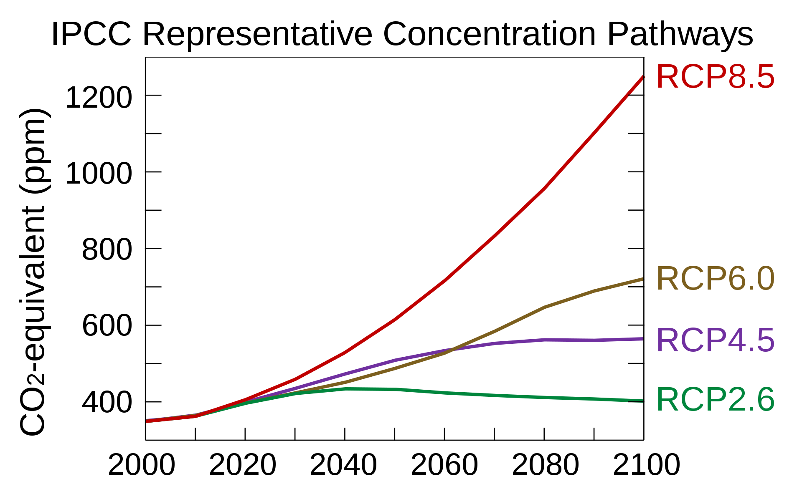
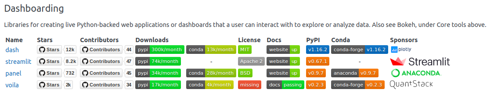
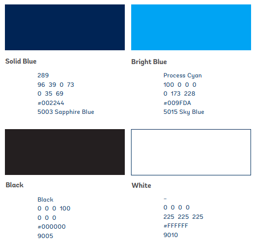
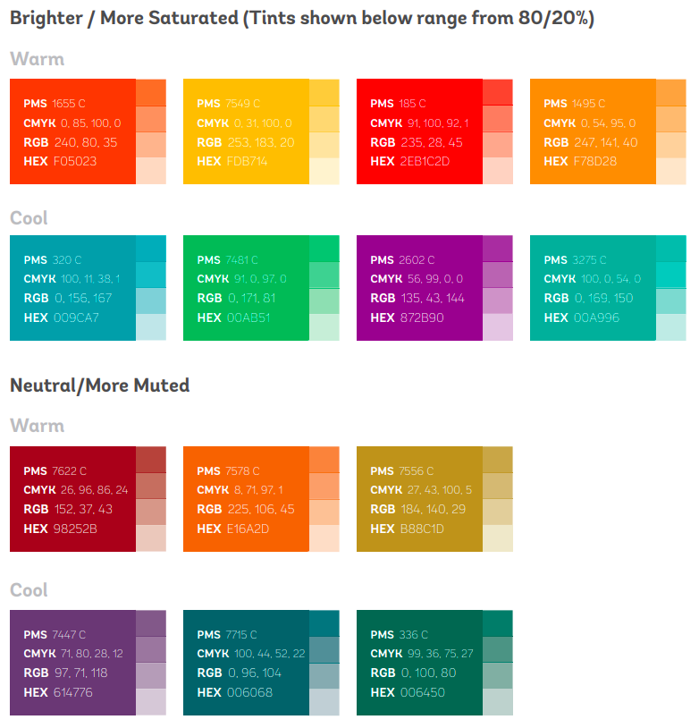
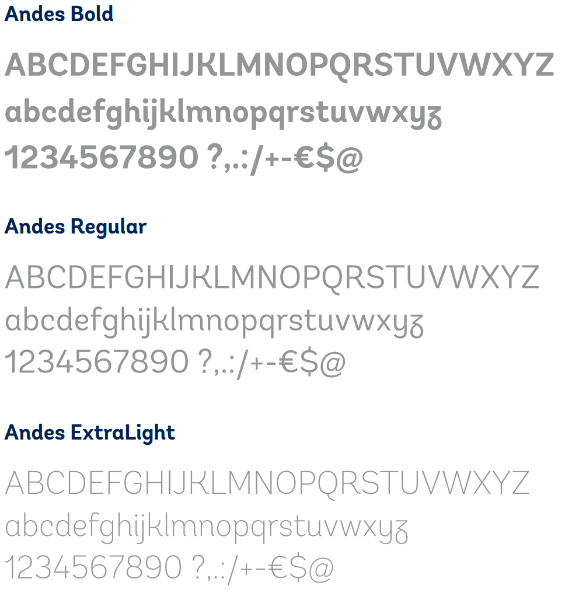
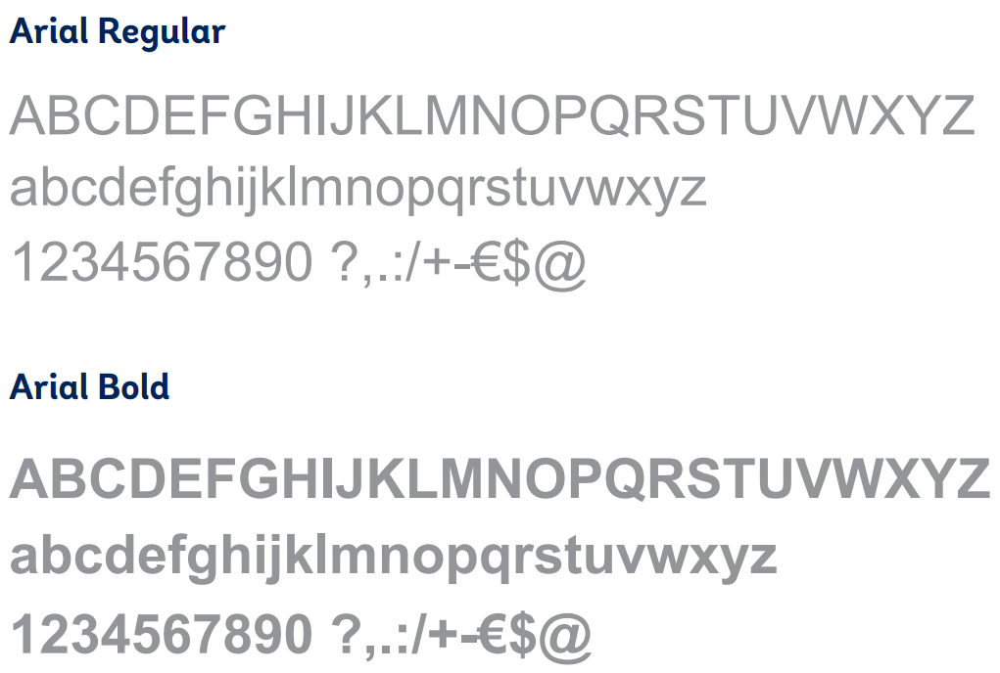

# Table of Contents

1.  [Prototyping](#orgf5f7097)
    1.  [Features](#orga7f5d7f)
    2.  [Wireframe](#org1cbfc3a)
        1.  [World map](#org91525d6)
        2.  [Regional focus](#orgbcc3a30)
        3.  [World figures](#orgdd37e8a)
2.  [Dataset](#org669f6ac)
    1.  [Variables](#org3a20e47)
    2.  [Data sources](#org52bfe91)
        1.  [`Decade`](#org6bc6b86)
        2.  [`UN_Geosheme_Subregion`](#orgfbaad0d)
        3.  [`Disaster_Type`](#orgb20ca8d)
        4.  [`RCP`](#org132a9f7)
        5.  [`DO`](#org2313b3b)
        6.  [`Human_Impact`](#org82761d9)
        7.  [`Financial_Impact`](#org9a0ac02)
        8.  [`°C`](#org1b38515)
        9.  [`Geo`](#orgf759fa2)
3.  [Development](#org9de4e2f)
    1.  [Why did we pick Dash?](#org0e0bd66)
    2.  [Architecture](#orga84e84e)
        1.  [Structure of `app.py`](#org97ade31)
            -   [Globals](#org1fbe834)
            -   [Layout](#orgca0988f)
            -   [Callbacks](#orged0c1ea)
        2.  [Required files in `assets` folder](#org8e5cc9f)
    3.  [Visual identity guidelines](#org985121d)
        1.  [Colors](#org9addadd)
            -   [Primary colors](#org650c23b)
            -   [Secondary colors](#org606ff95)
        2.  [Fonts](#org2197ad3)
            -   [Primary fonts](#org4dac9cb)
            -   [Secondary fonts](#org1f4869a)
        3.  [Logo](#orgd628bc3)
            -   [Symbol](#org8220c46)
            -   [Logotype](#org673de88)
    4.  [How to contribute](#org1f0910e)
        1.  [Setting up a new Git repository](#orgf991d0d)
        2.  [Adding or modifying owned files (`push`)](#org4b59ee9)
        3.  [Submit proposed changes to review](#org7e01743)
        4.  [Adding reviewed files (`merge`)](#org73e60ef)
4.  [Tools that we used](#org322a9c3)

# Prototyping

## Features

<table border="2" cellspacing="0" cellpadding="6" rules="groups" frame="hsides">

<colgroup>
<col  class="org-left" />

<col  class="org-left" />
</colgroup>
<thead>
<tr>
<th scope="col" class="org-left">Feature name</th>
<th scope="col" class="org-left">Description</th>
</tr>
</thead>

<tbody>
<tr>
<td class="org-left">Main layout</td>
<td class="org-left">Organise features and widgets on the main page</td>
</tr>

<tr>
<td class="org-left">World map</td>
<td class="org-left">Displays the world map, with UN sub regions</td>
</tr>

<tr>
<td class="org-left">World map dataviz</td>
<td class="org-left">Displays data on the worldmap, with a legend</td>
</tr>

<tr>
<td class="org-left">RCP thermometer</td>
<td class="org-left">To choose among the 4 RCP</td>
</tr>

<tr>
<td class="org-left">Disaster toggle</td>
<td class="org-left">To choose among 1 over 3 disaster type</td>
</tr>

<tr>
<td class="org-left">Impact toggle</td>
<td class="org-left">To choose between human or financial impact</td>
</tr>

<tr>
<td class="org-left">Selectable timeframe</td>
<td class="org-left">To choose from 1 to 20 decades</td>
</tr>

<tr>
<td class="org-left">Sub region mouseover</td>
<td class="org-left">Mouseover on a sub region triggers a popup</td>
</tr>

<tr>
<td class="org-left">Sub region popup</td>
<td class="org-left">Shows region's figures</td>
</tr>

<tr>
<td class="org-left">World figures</td>
<td class="org-left">Shows world figures</td>
</tr>

<tr>
<td class="org-left">World figures expand</td>
<td class="org-left">Button that triggers world figures popup</td>
</tr>

<tr>
<td class="org-left">World figures popup</td>
<td class="org-left">Expends world figures additional figures</td>
</tr>

<tr>
<td class="org-left">Play/Pause toggle</td>
<td class="org-left">launch a per decade animation on the world map</td>
</tr>
</tbody>
</table>

## Wireframe

### World map

### Regional focus

### World figures

# Dataset

## Variables

<table border="2" cellspacing="0" cellpadding="6" rules="groups" frame="hsides">

<colgroup>
<col  class="org-left" />

<col  class="org-left" />

<col  class="org-left" />
</colgroup>
<thead>
<tr>
<th scope="col" class="org-left">Variable name</th>
<th scope="col" class="org-left">Data type</th>
<th scope="col" class="org-left">Description/Example</th>
</tr>
</thead>

<tbody>
<tr>
<td class="org-left">`Decade`</td>
<td class="org-left">int64</td>
<td class="org-left">1900, 1910, &#x2026;, 2080, 2090</td>
</tr>

<tr>
<td class="org-left">`UN_Geosheme_Subregion`</td>
<td class="org-left">str</td>
<td class="org-left">'Australia and New Zealand', 'Caribbean', etc.</td>
</tr>

<tr>
<td class="org-left">`Disaster_Type`</td>
<td class="org-left">str</td>
<td class="org-left">Either 'Floods', 'Droughts' or 'Storms'</td>
</tr>

<tr>
<td class="org-left">`RCP`</td>
<td class="org-left">float64</td>
<td class="org-left">NaN for the past, either 2.6, 4.5, 6.0 or 8.5 for the future</td>
</tr>

<tr>
<td class="org-left">`DO`</td>
<td class="org-left">int64</td>
<td class="org-left">Provides the number of disasters<a id="fnr.1" class="footref" href="#fn.1">1</a>.</td>
</tr>

<tr>
<td class="org-left">`Human_Impact`</td>
<td class="org-left">int64</td>
<td class="org-left">Provides the number of impacted people<a id="fnr.1.100" class="footref" href="#fn.1">1</a>.</td>
</tr>

<tr>
<td class="org-left">`Financial_Impact`</td>
<td class="org-left">int64</td>
<td class="org-left">Provides the financial impact<a id="fnr.1.100" class="footref" href="#fn.1">1</a>.</td>
</tr>

<tr>
<td class="org-left">`°C`</td>
<td class="org-left">int64</td>
<td class="org-left">Provides the temperature in Celsius degrees<a id="fnr.2" class="footref" href="#fn.2">2</a></td>
</tr>

<tr>
<td class="org-left">`Geo`</td>
<td class="org-left">GeoPandas</td>
<td class="org-left">Geospatial data delimitating geoscheme sub regions on the map</td>
</tr>
</tbody>
</table>

## Data sources

### `Decade`

-   Source: in-house
-   Values: 
    
        Decade = [1900, 1910, 1920, 1930, 1940, 1950, 1960, 1970, 1980, 1990, 2000, 2010, 2020, 2030, 2040, 2050, 2060, 2070, 2080, 2090]
-   Notes: each value represents a decade. For example, `2020` starts with the year 2020 and ends with the year 2029.

### `UN_Geosheme_Subregion`

-   Source: [UN Geographic Intermediary Regions](https://unstats.un.org/unsd/methodology/m49/) used by the UN Statistics Division in its publications and databases.
-   Values:
    
        UN_Geosheme_Subregion = ['Australia and New Zealand','Caribbean','Central America','Central Asia','Eastern Africa','Eastern Asia','Eastern Europe','Melanesia','Micronesia','Middle Africa','Northern Africa','Northern America','Northern Europe','Polynesia','South America','South-Eastern Asia','Southern Africa','Southern Asia','Southern Europe','Western Africa','Western Asia','Western Europe']
-   Notes: This classification is also referred as [United Nations geoscheme](https://en.wikipedia.org/wiki/United_Nations_geoscheme) and [UN M49](https://en.wikipedia.org/wiki/UN_M49).

### `Disaster_Type`

-   Source: in-house
-   Values:

    Disaster_Type = ['Droughts', 'Floods', 'Storms']

-   Notes: These disasters will be respectively described in the following pages : [droughts](https://github.com/dataforgoodfr/batch8_worldbank/tree/master/model_secheresse), [floods](https://github.com/dataforgoodfr/batch8_worldbank/tree/master/model_innondations), and [storms](https://github.com/dataforgoodfr/batch8_worldbank/tree/master/model_tempetes)

### `RCP`

-   Source: [IPCC](https://www.iiasa.ac.at/web-apps/tnt/RcpDb/dsd?Action=htmlpage&page=welcome)
-   Values:

    RCP = [2.6, 4.5, 6.0, 8.5]

-   Notes: Representative Concentration Pathways (RCP) are greenhouse gas concentration (not emissions) trajectories adopted by the IPCC. Four pathways were used for climate modeling and research for the IPCC fifth Assessment Report (AR5) in 2014. The pathways describe different climate futures, all of which are considered possible depending on the volume of greenhouse gases (GHG) emitted in the years to come. The RCPs are labelled after a possible range of radiative forcing values in the year 2100.
    
    

### `DO`

-   Source: In-house (for prediction)
-   Values: Natural number (non-negative integers)
-   Notes: For explanation on past and future (based on in house statistical models) **Disaster Occurrences** (DO) see: [droughts](https://github.com/dataforgoodfr/batch8_worldbank/tree/master/model_secheresse), [floods](https://github.com/dataforgoodfr/batch8_worldbank/tree/master/model_innondations), and [storms](https://github.com/dataforgoodfr/batch8_worldbank/tree/master/model_tempetes) pages.

### `Human_Impact`

-   Source: In-house (for prediction)
-   Values: Natural number (non-negative integers)
-   Notes: For explanation on past and future (based on in house statistical models) Human Impact see: [droughts](https://github.com/dataforgoodfr/batch8_worldbank/tree/master/model_secheresse), [floods](https://github.com/dataforgoodfr/batch8_worldbank/tree/master/model_innondations), and [storms](https://github.com/dataforgoodfr/batch8_worldbank/tree/master/model_tempetes) pages.

### `Financial_Impact`

-   Source: In-house (for prediction)
-   Values: Natural number (non-negative integers)
-   Notes: For explanation on past and future (based on in house statistical models) Financial Impact see: [droughts](https://github.com/dataforgoodfr/batch8_worldbank/tree/master/model_secheresse), [floods](https://github.com/dataforgoodfr/batch8_worldbank/tree/master/model_innondations), and [storms](https://github.com/dataforgoodfr/batch8_worldbank/tree/master/model_tempetes) pages.

### `°C`

-   Source: [World Bank](https://climateknowledgeportal.worldbank.org/download-data)
-   Values: Temperatures

### `Geo`

-   Source: In-house (generated by [this script](https://github.com/dataforgoodfr/batch8_worldbank/blob/master/Dashboard/scripts/ContourGeneration.ipynb))

# Development

## Why did we pick [Dash](https://plotly.com/dash/)?

As we wanted to use Python to build the Dashboard we had to pick among [Python dashboard libraries](https://pyviz.org/tools.html) :

According to following benchmarck the team decided to develop the PoC with ****Dash****

<table border="2" cellspacing="0" cellpadding="6" rules="groups" frame="hsides">

<colgroup>
<col  class="org-left" />

<col  class="org-left" />

<col  class="org-left" />

<col  class="org-left" />

<col  class="org-left" />
</colgroup>
<thead>
<tr>
<th scope="col" class="org-left">&#xa0;</th>
<th scope="col" class="org-left">Maturity</th>
<th scope="col" class="org-left">Popularity</th>
<th scope="col" class="org-left">Simplicity</th>
<th scope="col" class="org-left">Adaptability</th>
</tr>
</thead>

<tbody>
<tr>
<td class="org-left">Streamlit</td>
<td class="org-left">C</td>
<td class="org-left">A</td>
<td class="org-left">A</td>
<td class="org-left">C</td>
</tr>

<tr>
<td class="org-left">Dash</td>
<td class="org-left">B</td>
<td class="org-left">A</td>
<td class="org-left">B</td>
<td class="org-left">B</td>
</tr>

<tr>
<td class="org-left">Voila</td>
<td class="org-left">C</td>
<td class="org-left">C</td>
<td class="org-left">A</td>
<td class="org-left">C</td>
</tr>
</tbody>
</table>

****Maturity****: Based on the age of the project and how stable it is.

****Popularity****: Based on adoption and GitHub stars.

****Simplicity****: Based on how easy it is to get started using the library.

****Adaptability****: Based on how flexible and opinionated the library is.

## Architecture

### Structure of `app.py`

#### Globals

##### Loading libraries, style, and data

-   Libraries

        import pandas as pd
        import json
        import plotly.express as px
        import plotly.graph_objects as go
        import dash
        import dash_html_components as html
        import dash_daq as daq
        import dash_core_components as dcc
        from dash.dependencies import Input, Output

-   Style

        external_stylesheets = ['assets/style.css']
        app = dash.Dash(__name__, external_stylesheets=external_stylesheets)

-   Geo data

        with open('data/un_subregion_contours.geojson') as json_data:
            regions_data = json.load(json_data)

-   Pandas DataFrame

        df = pd.read_csv("data/input.csv", decimal=".")

##### Data prep

    df_map_data = df.sort_values(by=['UN_Geosheme_Subregion'])
    YEARS = list(df.Decade.drop_duplicates())
    df_map_data["RCP"].fillna(value=0,inplace=True)
    DisasterTypes = df['Disaster_Type'].unique()
    MagnitudeTypes = ['Number of Occurrences', 'Financial impact', 'Human impact']
    Degree = df['RCP'].unique()
    DEFAULT_OPACITY = 0.8

##### Mapbox parameters

    mapbox_access_token = "pk.eyJ1IjoibWFoZGlrYXJhYmliZW4iLCJhIjoiY2tmeWlnZzJqMXhyMzJ0czgzcWc3ejViNyJ9.MsvguTk0F7cxDBaV1Zlm_g"
    mapbox_style = "mapbox://styles/mahdikarabiben/ckgzi4dac1jez19qlanqcpp5l"

##### Global functions

-   Title & Logo

        def Title_App():
            return html.Div(
        	className="pretty_container",
        	children=[
        	    html.Img(id="logo", src=app.get_asset_url("WorldBank_Logo@2x.png")),
        	    html.Br(),
        	    dcc.Markdown("""
        	    ### Natural Disasters Map
        	    """),
        	],
            )

-   World map

    -   Regional contours
    
            def choropleth_map(df, impact, colordisaster):
                return go.Figure(
            	px.choropleth_mapbox(
            	    geojson=regions_data,
            	    locations=df['UN_Geosheme_Subregion'].tolist(),
            	    featureidkey="properties.subregion",
            	    color=df[str(impact)].tolist(),
            	    color_continuous_scale=colordisaster,
            	    mapbox_style=mapbox_style,
            	    opacity=0.8,
            	    zoom=1,
            	    hover_name=df['UN_Geosheme_Subregion'].tolist(),
            	    labels={"color": "Magnitude"}
            	)
                )
    
    -   Display
    
            def display_map(df, impact, colordisaster):
                fig = choropleth_map(df, impact, colordisaster)
            
                # Specify layout information
                fig.update_layout(
            	margin={"r": 0, "t": 0, "l": 0, "b": 0},
            	mapbox_accesstoken=mapbox_access_token
                )
                return fig

-   Disaster selector

        def disaster_type_card():
            """
             :return: A Div containing the 3 disaster options
            """
            return html.Div(
        	children=[
        	    html.H5(dcc.Markdown("**Select a Disaster**")),
        	    dcc.RadioItems(
        		id="Disaster-Selector",
        		options=[
        		    {'label': i, 'value': i} for i in DisasterTypes
        		],
        		value='Droughts',
        		labelStyle={"display": "inline-block",
        			    "margin-top": "0px",
        			    "font-size": "16px",
        			    "padding": "12px 12px 12px 0px",
        			    },
        		labelClassName="data-group-labels", )
        	]
        
            )

-   Magnitude selector

        def magnitude_type_card():
            """
             :return: A Div containing the 3 magnitude options
            """
            return html.Div(
        	children=[
        	    html.H5(dcc.Markdown("**Select a Magnitude**")),
        	    dcc.RadioItems(
        		id="Magnitude-Selector",
        		options=[
        		    {'label': i, 'value': i} for i in MagnitudeTypes
        		],
        		value='Number of Occurrences',
        
        		labelStyle={#"display": "inline-block",
        			    "margin-top": "0px",
        			    "font-size": "16px",
        			    "padding": "12px 12px 12px 0px",
        			    },
        		labelClassName="data-group-labels", 
        	    )
        	]
        
            )

-   RCP selector

        def climate_scenario():
            return html.Div(
        	children=[
        	    html.H5(dcc.Markdown("**Select a RCP**")),
        	    html.Br(),
        	    dcc.Slider(
        			id="scenario-slider",
        			min=0,
        			max=10,
        			value=0,
        			step=None,
        		       # marks={2.6: "2.6°C", 4.5: "4.5°C", 6.0: "6.0°C",8.5:"8.5°C"},
        			marks={
        				0: {'label': '0', 'style': {'color': '#77b0b1'}},
        				2.6: {'label': '2.6', 'style': {'color': '#77b0b1'}},
        				4.5: {'label': '4.5'},
        				6: {'label': '6.0'},
        				8.5: {'label': '8.5', 'style': {'color': '#f50'}}
        			},
        			disabled=False                        
        
        		       )
        	]               
        )

#### Layout

    app.layout = html.Div(
        id="root",
        children=[
    	html.Div(
    	    id="app-container",
    	    children=[
    		html.Div(
    		    id="Rectangle_Menu",
    		    children=[
    			html.Div(
    			    className="pretty-container",
    			    children=[Title_App()]
    			),
    			html.Div(
    			    className="pretty_container",
    			    children=[disaster_type_card()]
    			),
    			html.Br(),
    			html.Div(
    			    className="pretty_container-3",
    			    children=[magnitude_type_card()]
    			),
    			html.Br(),
    			html.Div(
    			    className="pretty_container",
    			    children=[climate_scenario()]
    			),
    			html.Br(),
    			html.Div(
    			    className="pretty_container-2",
    			    children=[
    				html.Button('Expand World Figures', id='button.button-primary'),
    			    ]
    			),
    
    		    ],
    		),
    
    		html.Div(
    		    className="pretty_container-2",
    		    #     children=[
    		    #         html.P(id="world", children="WORLD"),
    		    #         html.Br(),
    		    #         html.Br(),
    		    #         repartition_cart(),
    		    # damage_type()
    		    #     ],
    		),
    		html.Div(
    		    id="right-column",
    		    children=[
    			html.Div(
    			    id="slider-container",
    			    children=[
    				html.P(
    				    id="slider-text",
    				    children="Drag the slider to choose the decade(s)",
    				),
    				dcc.RangeSlider(
    				    id="years-slider",
    				    min=1900,
    				    max=2090,
    				    step=10,
    				    value=[1900, 1920],
    				    marks={
    					str(year): {
    					    "label": str(year),
    					    "style": {"color": "#7fafdf"},
    					}
    					for year in YEARS
    				    },
    				),
    			    ],
    			),
    			html.Div(
    			    id="heatmap-container",
    			    children=[
    				html.P(
    				    "Choropleth map of disaster damages from {0} to {1}".format(
    					min(YEARS), min(YEARS) + 20
    				    ),
    				    id="heatmap-title",
    				),
    				dcc.Graph(
    				    id="county-choropleth",
    				    figure=display_map(
    					df_map_data[(df_map_data['Decade'] >= 1900)
    						    & (df_map_data['Decade'] <= 1920)
    						    & (df_map_data['Disaster_Type'] == 'Droughts')
    						    & (df_map_data['RCP'] == 2.6)],
    					'Human_Impact', 'reds')
    				),
    			    ],
    			),
    		    ],
    		),
    	    ],
    	),
        ],
    )

#### Callbacks

##### Map title

    @app.callback(Output("heatmap-title", "children"), [Input("years-slider", "value")])
    def update_map_title(year):
        return "Choropleth map from the beginning of the {0}s to the end of the {1}s".format(year[0], year[1])

##### Magnitude

    # YEAR INPUT & IMPACT TYPE
    @app.callback(
        Output("county-choropleth", "figure"),
        Input("years-slider", "value"),
        Input("Disaster-Selector", "value"),
        # Input("temp-slider","value"),
        # for callback : & (df_map_data['RCP'] == temp
        # def update_map(year,DisasterType,temp,MagnitudeType):
        Input("Magnitude-Selector", "value"),
        Input("scenario-slider","value")
        )
    def update_map(year, DisasterType, MagnitudeType,RcpType):
        df_decade_disaster_temp = (df_map_data[
    	((df_map_data['Decade'] >= year[0]) & (df_map_data['Decade'] <= year[1]) & (
    		df_map_data['Disaster_Type'] == DisasterType)& (df_map_data['RCP']== RcpType))]
        )
    
        if DisasterType == "Droughts":
    	color= "YlOrRd"
    	DisasterType ='Droughts'
    
        elif DisasterType == "Storms":
    	color = "RdPu"
    	DisasterType = 'Storms'
    
        elif DisasterType == "Floods":
    	color = "Blues"
    	DisasterType = 'Floods'
    
        if MagnitudeType == "Number of Occurrences":
    	magnitude_type = 'DO'   
    
        elif MagnitudeType == "Financial impact":
    	magnitude_type = 'Financial_Impact'
        elif MagnitudeType == 'Human impact':
    	magnitude_type = 'Human_Impact'
    
        df_decade_disaster_temp = (df_decade_disaster_temp
    			       .groupby(['UN_Geosheme_Subregion'])[magnitude_type]
    			       .sum()
    			       .reset_index())
    
        return display_map(df_decade_disaster_temp, magnitude_type, color)
    
    
    def hide_slider(year):
        if year[0] >= 2020:
    
    	return "Choropleth map of disaster damages from {0} to {1}".format(year[0], year[1])
    
    
    if __name__ == '__main__':
        app.run_server(debug=True, host="127.0.0.1", port=8050)

### Required files in `assets` folder

-   `style.css`
-   `WorldBank_Logo@2x.png`

## Visual identity guidelines

We will follow World Bank's visual identity guidelines for colors and fonts.

### Colors

#### Primary colors

<table border="2" cellspacing="0" cellpadding="6" rules="groups" frame="hsides">

<colgroup>
<col  class="org-left" />

<col  class="org-left" />
</colgroup>
<thead>
<tr>
<th scope="col" class="org-left">Name</th>
<th scope="col" class="org-left">Hex code</th>
</tr>
</thead>

<tbody>
<tr>
<td class="org-left">Sapphire blue</td>
<td class="org-left">#002244</td>
</tr>

<tr>
<td class="org-left">Sky blue</td>
<td class="org-left">#009FDA</td>
</tr>

<tr>
<td class="org-left">Black</td>
<td class="org-left">#000000</td>
</tr>

<tr>
<td class="org-left">White</td>
<td class="org-left">#FFFFFF</td>
</tr>
</tbody>
</table>

#### Secondary colors

<table border="2" cellspacing="0" cellpadding="6" rules="groups" frame="hsides">

<colgroup>
<col  class="org-left" />

<col  class="org-left" />
</colgroup>
<thead>
<tr>
<th scope="col" class="org-left">Family</th>
<th scope="col" class="org-left">Hex code</th>
</tr>
</thead>

<tbody>
<tr>
<td class="org-left">Brighter Warm</td>
<td class="org-left">F05023</td>
</tr>

<tr>
<td class="org-left">Brighter Warm</td>
<td class="org-left">FDB714</td>
</tr>

<tr>
<td class="org-left">Brighter Warm</td>
<td class="org-left">2EB1C2D</td>
</tr>

<tr>
<td class="org-left">Brighter Warm</td>
<td class="org-left">F78D28</td>
</tr>

<tr>
<td class="org-left">Brighter Cool</td>
<td class="org-left">009CA7</td>
</tr>

<tr>
<td class="org-left">Brighter Cool</td>
<td class="org-left">00AB51</td>
</tr>

<tr>
<td class="org-left">Brighter Cool</td>
<td class="org-left">872B90</td>
</tr>

<tr>
<td class="org-left">Brighter Cool</td>
<td class="org-left">00A996</td>
</tr>

<tr>
<td class="org-left">Muted Warm</td>
<td class="org-left">98252B</td>
</tr>

<tr>
<td class="org-left">Muted Warm</td>
<td class="org-left">E16A2D</td>
</tr>

<tr>
<td class="org-left">Muted Warm</td>
<td class="org-left">B88C1D</td>
</tr>

<tr>
<td class="org-left">Muted Cool</td>
<td class="org-left">614776</td>
</tr>

<tr>
<td class="org-left">Muted Cool</td>
<td class="org-left">006068</td>
</tr>

<tr>
<td class="org-left">Muted Cool</td>
<td class="org-left">006450</td>
</tr>
</tbody>
</table>

### Fonts

#### Primary fonts

#### Secondary fonts

### Logo

#### Symbol

#### Logotype

## How to contribute

### Setting up a new Git repository

-   Clone project locally
    
        $ git init
        $ git clone https://github.com/dataforgoodfr/batch8_worldbank/tree/master/plateforme
-   Ask to join our GitHub

### Adding or modifying owned files (`push`)

When adding a new file or modifying a file that you own, do:

    $ git add filename
    $ git commit
    $ git push

Where `filename` is the name of the file

### Submit proposed changes to review

When modifying an existing file, if you're not its owner, you have to submit the modifications to its owner (i.e. reviewer). Ownership is distributed as follow :

<table border="2" cellspacing="0" cellpadding="6" rules="groups" frame="hsides">

<colgroup>
<col  class="org-left" />

<col  class="org-left" />
</colgroup>
<thead>
<tr>
<th scope="col" class="org-left">Owner GitHub name</th>
<th scope="col" class="org-left">File</th>
</tr>
</thead>

<tbody>
<tr>
<td class="org-left">mahdiqb</td>
<td class="org-left">`./app.py`</td>
</tr>

<tr>
<td class="org-left">morgandavidson</td>
<td class="org-left">`./README.md`</td>
</tr>

<tr>
<td class="org-left">alencon</td>
<td class="org-left">`./asset/style.css`</td>
</tr>
</tbody>
</table>

To submit changes reviewees have to do: 

    $ git add filename
    $ git commit
    $ hub pull-request -h revieweename:master -b dataforgoodfr:master -r reviewername -f -o

Where `revieweename` and `reviewername` are the GitHub names of the reviewee and the reviewer/owner.

### Adding reviewed files (`merge`)

-Reviewers have to do 

    $ hub merge PRurl 

Where `PRurl` is the url of the pull request.

# Tools that we used

<table border="2" cellspacing="0" cellpadding="6" rules="groups" frame="hsides">

<colgroup>
<col  class="org-left" />

<col  class="org-left" />
</colgroup>
<thead>
<tr>
<th scope="col" class="org-left">Tools</th>
<th scope="col" class="org-left">Usage</th>
</tr>
</thead>

<tbody>
<tr>
<td class="org-left">Slack</td>
<td class="org-left">Chat</td>
</tr>

<tr>
<td class="org-left">Pycharm, Jupyter</td>
<td class="org-left">Code editing</td>
</tr>

<tr>
<td class="org-left">Git, GitHub</td>
<td class="org-left">Code storage/versioning</td>
</tr>

<tr>
<td class="org-left">Python, CSS</td>
<td class="org-left">Coding languages</td>
</tr>

<tr>
<td class="org-left">Org-mode, Github, Notion</td>
<td class="org-left">Documentation</td>
</tr>

<tr>
<td class="org-left">Zoom</td>
<td class="org-left">Meetings</td>
</tr>

<tr>
<td class="org-left">dash, dash-daq pandas, gunicorn</td>
<td class="org-left">Python librairies</td>
</tr>

<tr>
<td class="org-left">Krita, Figma</td>
<td class="org-left">Wireframing</td>
</tr>
</tbody>
</table>

# Footnotes

<a id="fn.1" href="#fnr.1">1</a> Given a disaster, a decade, a region, and a climate scenario

<a id="fn.2" href="#fnr.2">2</a> Given a decade, a region, and a climate scenario.
